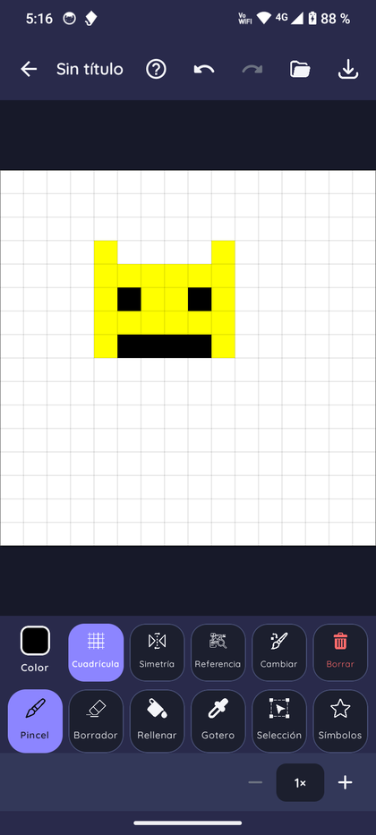
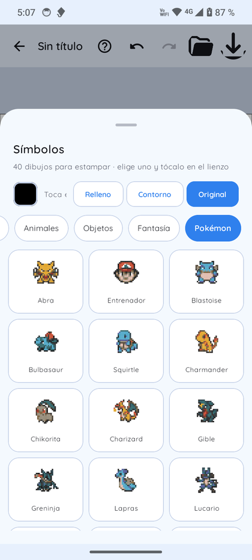
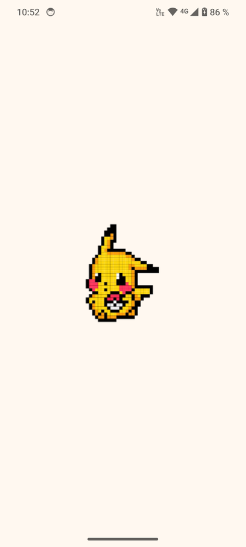
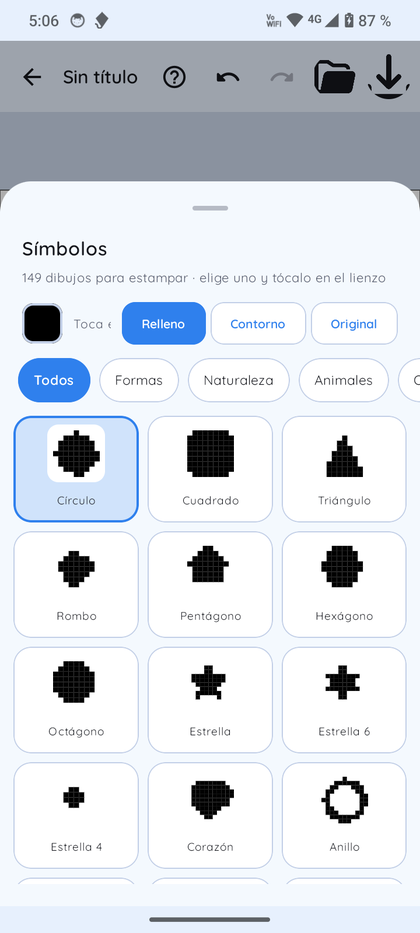
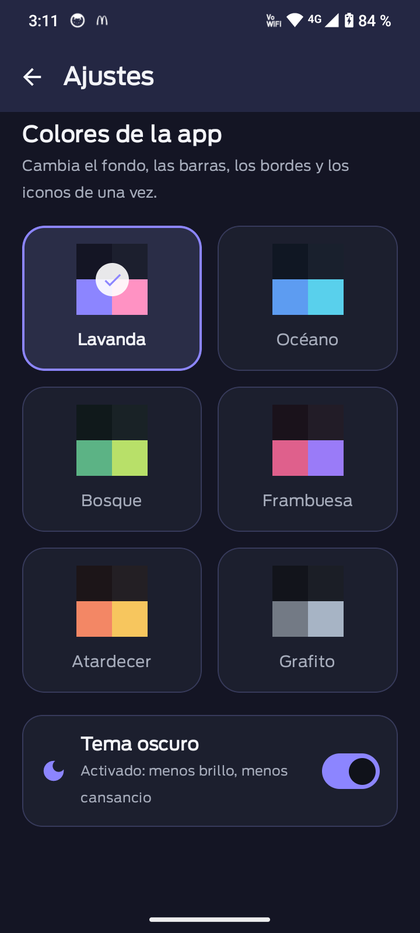
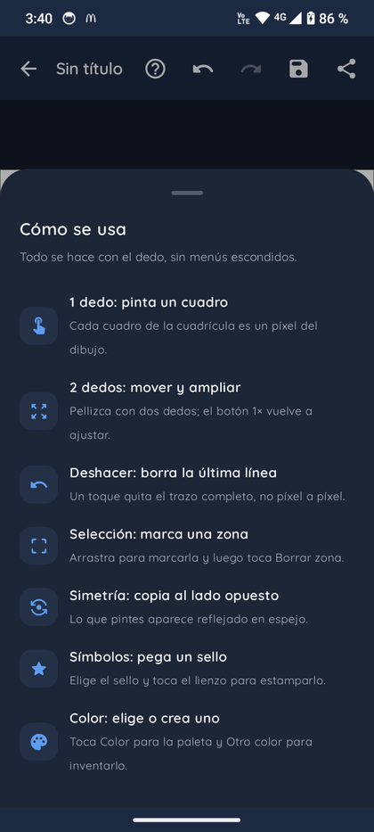
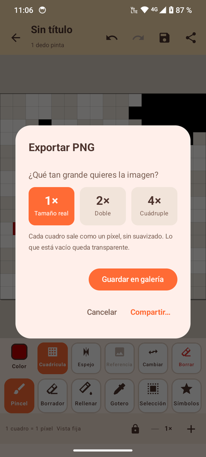

# Pixelados

**Editor de pixel art para Android, pensado para que un niño de 10 años dibuje con el dedo.**

-3DDC84?logo=android&logoColor=white)


Cada cuadro de la cuadrícula es **un píxel del dibujo**, y el lienzo se comporta como el de un editor de
escritorio pero con reglas de interacción simples: **un dedo pinta, dos dedos mueven y amplían**.

 

## Qué hace

- **Lienzo de píxeles exacto**: celdas cuadradas, relleno completo por celda y sin suavizado al exportar.
  Tamaños de 16×16, 32×32, 64×64 y 100×100, más tamaño personalizado entre 8 y 128.
- **Herramientas de dibujo**: pincel de un píxel, borrador, relleno por zona, cuentagotas y selección
  rectangular (marcar zona y borrarla).
- **Color**: paleta de **288 colores** en nueve familias pensadas para niños, fila de **colores recientes**,
  color personalizado con dos deslizadores y opción de **reemplazar un color** en todo el dibujo.
- **Símbolos**: galería con **149 figuras** —109 geométricas, de naturaleza, animales, objetos y fantasía, más
  **40 Pokémon** creados desde referencias pixel art— en tres estilos: **relleno**, **contorno** o
  **color original** de la figura.
- **Simetría** horizontal y vertical, cuadrícula conmutable y **capa de referencia** para calcar una foto con
  opacidad ajustable.
- **Deshacer por trazo**: una línea completa se deshace de una vez, no píxel a píxel, con 50 pasos de historial.
- **Conversión de foto a pixel art**: reducción por promedio de área, nivel de detalle ajustable y
  cuantización contra la paleta de la app.
- **Exportación PNG a 1×, 2× y 4×** con nearest-neighbor, transparencia conservada, guardado en la galería y
  hoja de compartir.
- **Apariencia**: seis paletas (Lavanda, Océano, Bosque, Frambuesa, Atardecer y Grafito) y **modo claro/oscuro**;
  se eligen en Ajustes y recolorean toda la app, incluidas barras, bordes, iconos y textos.
- **Guardado automático** de cada dibujo con miniatura y galería de "Mis lienzos" en la pantalla de inicio.

## Capturas

| | | |
|:--:|:--:|:--:|
|  |  |  |
| Pantalla de carga | Galería de símbolos por categorías | Paletas y modo claro/oscuro |
|  |  |  |
| Ayuda dentro del editor | Exportación PNG sin suavizado | Categoría Pokémon con colores propios |

## Reglas de producto

Estas decisiones explican casi todo el comportamiento del editor:

1. **Una celda equivale a un píxel relleno por completo.** El tamaño de celda se calcula en píxeles enteros,
   así que el mapa del dedo, la cuadrícula y el dibujo coinciden exactamente.
2. **Un dedo pinta; dos dedos mueven y amplían**, siempre. La vista fija por defecto evita descolocar el lienzo
   sin querer y el botón `1×` devuelve el zoom a la vista completa.
3. **Deshacer agrupa por trazo.** Los cambios muy seguidos se funden en una sola entrada para que deshacer
   nunca borre píxel a píxel.
4. **Los símbolos se colocan al soltar el dedo**, con vista previa que aparece centrada en el lienzo y sigue
   al dedo mientras se arrastra.
5. **La interfaz no se reacomoda**: las filas de herramientas y acciones tienen altura fija y las opciones de
   cada herramienta viven en una franja propia.
6. **Las guías van en ventanas emergentes**, no incrustadas en la barra de herramientas.

## Cómo compilar

Requisitos: **JDK 21**, **Android SDK 36** y un dispositivo o emulador con **Android 8.0 (API 26)** o superior.

```bash
./gradlew assembleDebug              # compila, publica el APK e intenta instalarlo en el dispositivo
./gradlew testDebugUnitTest          # pruebas unitarias
./gradlew connectedDebugAndroidTest  # pruebas instrumentadas (requiere dispositivo conectado)
```

El APK queda en `app/build/outputs/apk/debug/pixelados.apk` y el proyecto lo copia a `apk/pixelados.apk`.
Cada compilación avanza el `versionCode`, que la app muestra con nombres de letras griegas
(`1 = alfa`, `2 = beta`, …) para identificar cada build entregada.

En Windows hay dos atajos: `build_and_run.ps1` (compila e instala) y `verify_on_device.ps1` (compila, instala,
corre las pruebas instrumentadas y guarda capturas).

> Las pruebas instrumentadas **desinstalan la app** al terminar y con ella sus datos: los lienzos guardados en
> el teléfono se pierden. Exporta a la galería lo que quieras conservar antes de correrlas.

## Pruebas

**26 pruebas unitarias** (JVM) cubren el modelo y las reglas del pixel art: pintado de una celda, relleno por
región, reemplazo de color, espejo, geometría del trazo continuo, serialización de los proyectos guardados,
catálogo de símbolos sin nombres repetidos y estampado de las 149 figuras en los tres estilos.

**15 pruebas instrumentadas** (en dispositivo) verifican la interfaz: pintar una celda, trazo largo, relleno,
deshacer por trazo y tras un relleno, zoom con dos dedos, recorrido completo de la galería de símbolos por
categoría y estilo, símbolo centrado y colocado al soltar, guardado al salir y apertura de un lienzo guardado
sin cerrar la app.

## Arquitectura

| Paquete | Responsabilidad |
|---|---|
| `data/model` | Lienzo de píxeles con sus reglas puras, paleta, proyectos, sellos y catálogos de símbolos |
| `data/repository` | Persistencia (lienzos y colores recientes en JSON) y preferencias de apariencia |
| `data/util` | Conversión de foto a pixel art |
| `ui/theme` | Paletas, modo claro/oscuro y tipografía |
| `ui/components` | Vista del lienzo (gestos, cuadrícula, vista previa) y panel de color |
| `ui/screens` | Inicio, selección de tamaño, detalle de la foto, editor, ajustes y acerca de |
| `ui/viewmodel` | Estado del dibujo con historial, y listado de lienzos guardados |

Archivos clave: [`PixelCanvas.kt`](app/src/main/java/com/pixelados/data/model/PixelCanvas.kt) (reglas del
lienzo), [`PixelCanvasView.kt`](app/src/main/java/com/pixelados/ui/components/PixelCanvasView.kt) (dibujo y
gestos), [`EditorViewModel.kt`](app/src/main/java/com/pixelados/ui/viewmodel/EditorViewModel.kt) (historial y
autoguardado), [`EditorScreen.kt`](app/src/main/java/com/pixelados/ui/screens/EditorScreen.kt) (interfaz del
editor) y [`StampCatalog.kt`](app/src/main/java/com/pixelados/data/model/StampCatalog.kt) (catálogo de figuras).

```
app/src/main/java/com/pixelados/
├── data/
│   ├── model/       PixelCanvas · ColorPalette · Project · Stamp · StampCatalog · PokemonCatalog
│   ├── repository/  ProjectRepository · SavedColorsRepository · ThemePreferences
│   └── util/        PhotoPixelator
├── ui/
│   ├── components/  PixelCanvasView · ColorPalettePanel
│   ├── navigation/  PixeladosNavHost
│   ├── screens/     Home · SizeSelector · DetailLevel · Editor · Settings · About
│   ├── theme/       Palettes · PixeladosTheme
│   └── viewmodel/   EditorViewModel · HomeViewModel
├── util/            VersionHelper
└── MainActivity.kt
tools/               generadores del catálogo de símbolos e iconos, y utilidades de medición
```

## Roadmap

- Build de **release con R8** (APK mucho más liviano) y publicación del APK en *Releases*.
- **Escalado de los símbolos** según el tamaño del lienzo, para que una figura grande no se recorte en
  lienzos pequeños.
- Categoría de **criaturas originales** y más figuras en el catálogo.
- Sustituir la mascota y la categoría de personajes de terceros por arte propio antes de publicar en tiendas.

## Aviso sobre contenido de terceros

La categoría *Pokémon* y la mascota actual son recreaciones pixel art basadas en personajes registrados de
Nintendo / Game Freak, hechas con fines personales y educativos a partir de referencias propias. Este
repositorio no está afiliado ni patrocinado por Nintendo. Si el proyecto se publica en una tienda, esa
categoría y la mascota deben reemplazarse por diseños originales.

## Autor

**Luis Gonzalez** — AI Engineer · Programmer · Entrepreneur

- GitHub: [@lgonzalh](https://github.com/lgonzalh)
- LinkedIn: [lantonium](https://www.linkedin.com/in/lantonium/)
- Web: [lantonium.com](https://lantonium.com/acerca)
- Correo: lgonzalh@outlook.com

## Licencia

© 2021–2026 Luis Gonzalez. Todos los derechos reservados.
